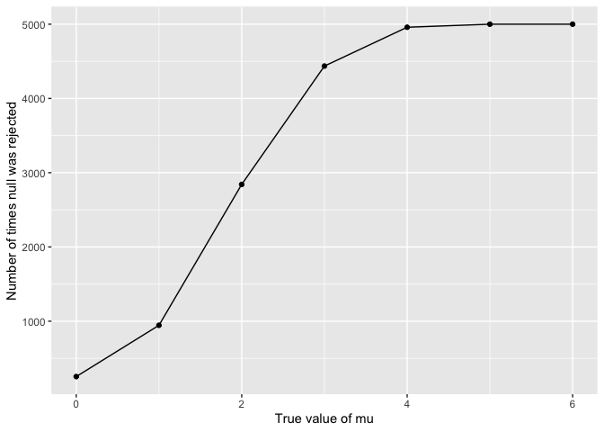
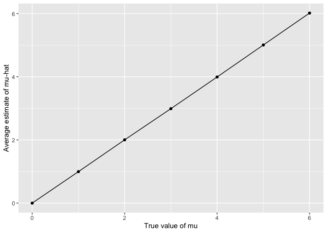

p8105_hw5_dcm2192
================
Dylan Morgan
2024-11-15

``` r
library(tidyverse)
library(rvest)
set.seed(1)
```

### Problem 1

### Problem 2

Define function.

``` r
sim_mean_sd <- function(mu, n = 30, sigma = 5) {
  sim_data = tibble(
    x = rnorm(n, mean = mu, sd = sigma)
  )
  sim_data |> 
    t.test() |> 
    broom::tidy() |> 
    summarize(
      mu_hat = estimate, 
      p_value = p.value
    )
}
```

Datasets with mu 0-6.

``` r
sim_results_df <- 
  expand_grid(
    mu = c(0:6),
    iter = 1:5000
  ) |> 
  mutate(
    estimate_df = map(mu, sim_mean_sd)
  ) |> 
  unnest(estimate_df)
```

Plot mu 0-6 where null was rejected.

``` r
sim_results_df |> 
  filter(p_value <= 0.05) |> 
  group_by(mu) |> 
  summarize(n_obs = n()) |> 
  ggplot(aes(x = mu, y = n_obs)) + 
  geom_point() + 
  geom_line() + 
  labs(x = "True value of mu", y = "Number of times null was rejected")
```

<!-- -->

The relationship between effect size and power is such that the number
of times the null is rejected increases as the true value of mu
increases.

Plot avg estimate of mu-hat and true value of mu.

``` r
sim_results_df |> 
  group_by(mu) |> 
  summarize(avg_mu_hat = mean(mu_hat)) |> 
  ggplot(aes(x = mu, y = avg_mu_hat)) + 
  geom_point() + 
  geom_line() + 
  labs(x = "True value of mu", y = "Average estimate of mu-hat")
```

<!-- -->

Plot avg estimate of mu-hat (where null was rejected) and true value of
mu.

``` r
sim_results_df |> 
  filter(p_value <= 0.05) |> 
  group_by(mu) |> 
  summarize(avg_mu_hat = mean(mu_hat)) |> 
  ggplot(aes(x = mu, y = avg_mu_hat)) + 
  geom_point() + 
  geom_line() + 
  labs(x = "True value of mu", y = "Average estimate of mu-hat where null was rejected")
```

<!-- -->

The sample average of mu-hat across tests for which the null is rejected
is approximately equal to the true value of mu because for mu values
greater than 3, the average mu-hat estimate is virtually equal to the
true value of mu. This is not the case for the average mu-hat estimates
for the mu values of 1 and 2, respectively; as the true value of mu
increases from 1, however, the average mu-hat estimate gets closer to
the true value of mu.

### Problem 3

Load raw data.

``` r
homicide_data <- 
  read_csv("./data/homicide-data.csv")
```

    ## Rows: 52179 Columns: 12
    ## ── Column specification ────────────────────────────────────────────────────────
    ## Delimiter: ","
    ## chr (9): uid, victim_last, victim_first, victim_race, victim_age, victim_sex...
    ## dbl (3): reported_date, lat, lon
    ## 
    ## ℹ Use `spec()` to retrieve the full column specification for this data.
    ## ℹ Specify the column types or set `show_col_types = FALSE` to quiet this message.

The raw data for `homicide_data` contains 52179 observations of 12
variables. The variables featured in this dataset include the reported
date of the homicide; the name, race, age, and sex of the victim; the
location in which the homicide occurred; and the status of the case
(`disposition`) in terms of whether it remains open with no arrest, or
whether it has been closed with or without an arrest.

Create city_state variable, summarize homicide data by city_state.

``` r
homicide_data <-
  homicide_data |>
  mutate(
    city_state = str_c(city, ", ", state)
  )

homicide_data |>
  group_by(city_state) |>
  summarize(n_obs = n())
```

    ## # A tibble: 51 × 2
    ##    city_state      n_obs
    ##    <chr>           <int>
    ##  1 Albuquerque, NM   378
    ##  2 Atlanta, GA       973
    ##  3 Baltimore, MD    2827
    ##  4 Baton Rouge, LA   424
    ##  5 Birmingham, AL    800
    ##  6 Boston, MA        614
    ##  7 Buffalo, NY       521
    ##  8 Charlotte, NC     687
    ##  9 Chicago, IL      5535
    ## 10 Cincinnati, OH    694
    ## # ℹ 41 more rows

``` r
homicide_data |> 
  filter(disposition != "Closed by arrest") |> 
  group_by(city_state, disposition) |> 
  summarize(n_obs = n())
```

    ## `summarise()` has grouped output by 'city_state'. You can override using the
    ## `.groups` argument.

    ## # A tibble: 95 × 3
    ## # Groups:   city_state [50]
    ##    city_state      disposition           n_obs
    ##    <chr>           <chr>                 <int>
    ##  1 Albuquerque, NM Closed without arrest    52
    ##  2 Albuquerque, NM Open/No arrest           94
    ##  3 Atlanta, GA     Closed without arrest    58
    ##  4 Atlanta, GA     Open/No arrest          315
    ##  5 Baltimore, MD   Closed without arrest   152
    ##  6 Baltimore, MD   Open/No arrest         1673
    ##  7 Baton Rouge, LA Closed without arrest    16
    ##  8 Baton Rouge, LA Open/No arrest          180
    ##  9 Birmingham, AL  Closed without arrest    64
    ## 10 Birmingham, AL  Open/No arrest          283
    ## # ℹ 85 more rows

Baltimore prop test.

``` r
baltimore_prop_test <- 
  prop.test(
  x = (homicide_data |> 
         filter(city_state == "Baltimore, MD", 
                disposition != "Closed by arrest") |> 
         nrow()), 
  n = (homicide_data |> 
         filter(city_state == "Baltimore, MD") |> 
         nrow()), 
  p = 0.5) |> 
  broom::tidy() |> 
  select(estimate, conf.low, conf.high)
```
