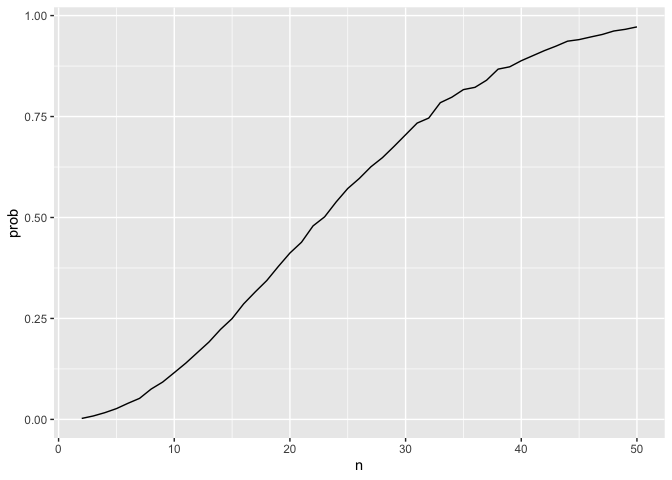
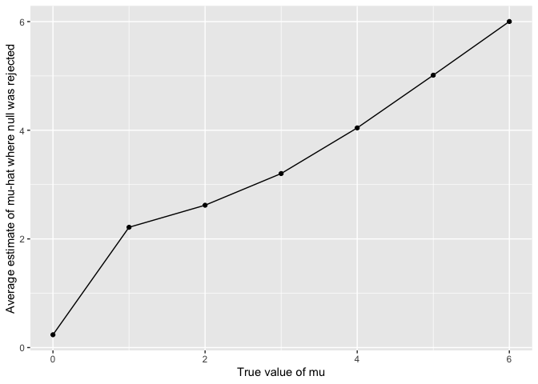
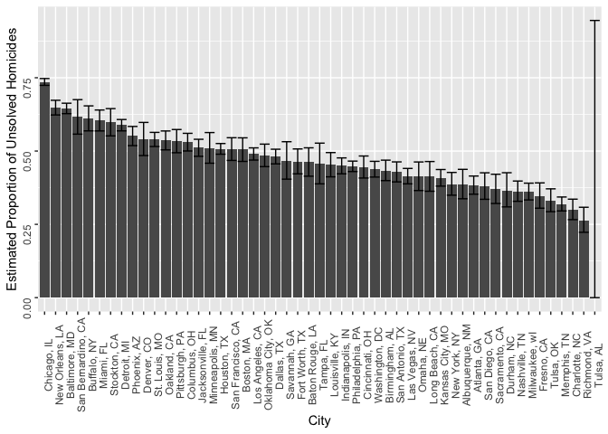

p8105_hw5_dcm2192
================
Dylan Morgan
2024-11-15

``` r
library(tidyverse)
library(rvest)
set.seed(1)
```

### Problem 1

Define birthday function.

``` r
bday_sim <- function(n) {
  bdays = sample(1:365, size = n, replace = TRUE)
  duplicate = length(unique(bdays)) < n
  return(duplicate)
}
```

Plot results of birthday simulations.

``` r
bday_sim_res <- 
  expand_grid(
    n = 2:50,
    iter = 1:10000
  ) |> 
  mutate(res = map_lgl(n, bday_sim)) |> 
  group_by(n) |> 
  summarize(prob = mean(res))

bday_sim_res |> 
  ggplot(aes(x = n, y = prob )) + 
  geom_line()
```

<!-- -->

### Problem 2

Define function.

``` r
sim_mean_sd <- function(mu, n = 30, sigma = 5) {
  sim_data = tibble(
    x = rnorm(n, mean = mu, sd = sigma)
  )
  sim_data |> 
    t.test() |> 
    broom::tidy() |> 
    summarize(
      mu_hat = estimate, 
      p_value = p.value
    )
}
```

Datasets with mu 0-6.

``` r
sim_results_df <- 
  expand_grid(
    mu = c(0:6),
    iter = 1:5000
  ) |> 
  mutate(
    estimate_df = map(mu, sim_mean_sd)
  ) |> 
  unnest(estimate_df)

head(sim_results_df, 10)
```

    ## # A tibble: 10 × 4
    ##       mu  iter  mu_hat p_value
    ##    <int> <int>   <dbl>   <dbl>
    ##  1     0     1 -1.62    0.0545
    ##  2     0     2 -0.542   0.569 
    ##  3     0     3 -0.278   0.767 
    ##  4     0     4 -0.303   0.733 
    ##  5     0     5  0.406   0.637 
    ##  6     0     6  0.147   0.881 
    ##  7     0     7  1.20    0.191 
    ##  8     0     8 -0.0542  0.957 
    ##  9     0     9 -0.119   0.878 
    ## 10     0    10 -1.89    0.0712

Plot mu 0-6 where null was rejected.

``` r
sim_results_df |> 
  filter(p_value <= 0.05) |> 
  group_by(mu) |> 
  summarize(n_obs = n()) |> 
  ggplot(aes(x = mu, y = n_obs)) + 
  geom_point() + 
  geom_line() + 
  labs(x = "True value of mu", y = "Number of times null was rejected")
```

<!-- -->

The relationship between effect size and power is such that the number
of times the null is rejected increases as the true value of mu
increases.

Plot avg estimate of mu-hat and true value of mu.

``` r
sim_results_df |> 
  group_by(mu) |> 
  summarize(avg_mu_hat = mean(mu_hat)) |> 
  ggplot(aes(x = mu, y = avg_mu_hat)) + 
  geom_point() + 
  geom_line() + 
  labs(x = "True value of mu", y = "Average estimate of mu-hat")
```

<!-- -->

Plot avg estimate of mu-hat (where null was rejected) and true value of
mu.

``` r
sim_results_df |> 
  filter(p_value <= 0.05) |> 
  group_by(mu) |> 
  summarize(avg_mu_hat = mean(mu_hat)) |> 
  ggplot(aes(x = mu, y = avg_mu_hat)) + 
  geom_point() + 
  geom_line() + 
  labs(x = "True value of mu", y = "Average estimate of mu-hat where null was rejected")
```

<!-- -->

The sample average of mu-hat across tests for which the null is rejected
is approximately equal to the true value of mu because for mu values
greater than 3, the average mu-hat estimate is virtually equal to the
true value of mu. This is not the case for the average mu-hat estimates
for the mu values of 1 and 2, respectively; as the true value of mu
increases from 1, however, the average mu-hat estimate gets closer to
the true value of mu.

### Problem 3

Load raw data.

``` r
homicide_data <- 
  read_csv("./data/homicide-data.csv")
```

    ## Rows: 52179 Columns: 12
    ## ── Column specification ────────────────────────────────────────────────────────
    ## Delimiter: ","
    ## chr (9): uid, victim_last, victim_first, victim_race, victim_age, victim_sex...
    ## dbl (3): reported_date, lat, lon
    ## 
    ## ℹ Use `spec()` to retrieve the full column specification for this data.
    ## ℹ Specify the column types or set `show_col_types = FALSE` to quiet this message.

The raw data for `homicide_data` contains 52179 observations of 12
variables. The variables featured in this dataset include the reported
date of the homicide; the name, race, age, and sex of the victim; the
location in which the homicide occurred; and the status of the case
(`disposition`) in terms of whether it remains open with no arrest, or
whether it has been closed with or without an arrest.

Create city_state variable, summarize homicide data by city_state.

``` r
homicide_data <-
  homicide_data |>
  mutate(
    city_state = str_c(city, ", ", state)
  )

homicide_data_summarized <- 
  homicide_data |> 
  group_by(city_state, disposition) |> 
  summarize(n_obs = n()) |> 
  pivot_wider(
    names_from = "disposition", 
    values_from = "n_obs"
  ) |> 
  janitor::clean_names() |> 
  mutate(
    unsolved = sum(closed_without_arrest, open_no_arrest, na.rm = TRUE), 
    total_cases = sum(closed_by_arrest, closed_without_arrest, open_no_arrest, na.rm = TRUE)
  ) |> 
  rename(solved = closed_by_arrest) |> 
  select(solved, unsolved, total_cases)
```

    ## `summarise()` has grouped output by 'city_state'. You can override using the
    ## `.groups` argument.
    ## Adding missing grouping variables: `city_state`

``` r
head(homicide_data_summarized, 10)
```

    ## # A tibble: 10 × 4
    ## # Groups:   city_state [10]
    ##    city_state      solved unsolved total_cases
    ##    <chr>            <int>    <int>       <int>
    ##  1 Albuquerque, NM    232      146         378
    ##  2 Atlanta, GA        600      373         973
    ##  3 Baltimore, MD     1002     1825        2827
    ##  4 Baton Rouge, LA    228      196         424
    ##  5 Birmingham, AL     453      347         800
    ##  6 Boston, MA         304      310         614
    ##  7 Buffalo, NY        202      319         521
    ##  8 Charlotte, NC      481      206         687
    ##  9 Chicago, IL       1462     4073        5535
    ## 10 Cincinnati, OH     385      309         694

Define prop test function.

``` r
prop_test_func <- function(unsolved, total_cases) {
  prop.test(
    x = unsolved, 
    n = total_cases, 
    p = 0.5
  ) |> 
    broom::tidy() |> 
    select(estimate, conf.low, conf.high)
}
```

Baltimore prop test.

``` r
baltimore_prop_test <- 
  homicide_data_summarized |> 
  filter(city_state == "Baltimore, MD") |> 
  mutate(
    prop_est_df = map2(unsolved, total_cases, prop_test_func)
  ) |> 
  unnest(prop_est_df) |> 
  select(-c(solved, unsolved, total_cases))

baltimore_prop_test
```

    ## # A tibble: 1 × 4
    ## # Groups:   city_state [1]
    ##   city_state    estimate conf.low conf.high
    ##   <chr>            <dbl>    <dbl>     <dbl>
    ## 1 Baltimore, MD    0.646    0.628     0.663

Map through all city_state values to apply prop test function.

``` r
prop_test_results_df <- 
  homicide_data_summarized |> 
  mutate(
    prop_est_df = map2(unsolved, total_cases, prop_test_func)
  ) |> 
  unnest(prop_est_df)
```

    ## Warning: There was 1 warning in `mutate()`.
    ## ℹ In argument: `prop_est_df = map2(unsolved, total_cases, prop_test_func)`.
    ## ℹ In group 49: `city_state = "Tulsa, AL"`.
    ## Caused by warning in `prop.test()`:
    ## ! Chi-squared approximation may be incorrect

``` r
head(prop_test_results_df, 10)
```

    ## # A tibble: 10 × 7
    ## # Groups:   city_state [10]
    ##    city_state      solved unsolved total_cases estimate conf.low conf.high
    ##    <chr>            <int>    <int>       <int>    <dbl>    <dbl>     <dbl>
    ##  1 Albuquerque, NM    232      146         378    0.386    0.337     0.438
    ##  2 Atlanta, GA        600      373         973    0.383    0.353     0.415
    ##  3 Baltimore, MD     1002     1825        2827    0.646    0.628     0.663
    ##  4 Baton Rouge, LA    228      196         424    0.462    0.414     0.511
    ##  5 Birmingham, AL     453      347         800    0.434    0.399     0.469
    ##  6 Boston, MA         304      310         614    0.505    0.465     0.545
    ##  7 Buffalo, NY        202      319         521    0.612    0.569     0.654
    ##  8 Charlotte, NC      481      206         687    0.300    0.266     0.336
    ##  9 Chicago, IL       1462     4073        5535    0.736    0.724     0.747
    ## 10 Cincinnati, OH     385      309         694    0.445    0.408     0.483

Plot prop estimates of unsolved homicides and CIs for each city.

``` r
prop_test_results_df |> 
  ggplot(aes(x = fct_rev(fct_reorder(city_state, estimate)))) + 
  geom_col(aes(y = estimate)) + 
  geom_errorbar(aes(ymin = conf.low, ymax = conf.high)) + 
  theme(axis.text = element_text(angle = 90)) + 
  labs(x = "City", y = "Estimated Proportion of Unsolved Homicides")
```

<!-- -->

After running the proportion test for all cities included in this
dataset, it appears that the warning message produced is due to
incomplete and/or inaccurate data from Tulsa, AL. As a result, the error
bar is much longer for Tulsa, AL, than it is for any other city. This
suggests that this observation should probably be removed from the
dataset.
